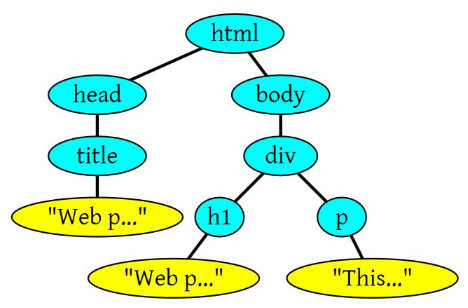
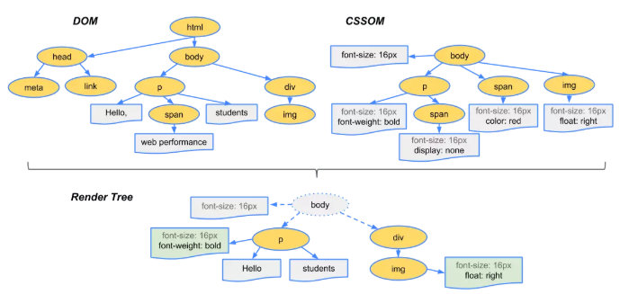
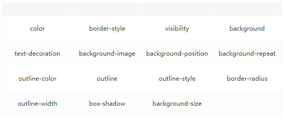

## 浏览器渲染原理 ———— Principle of browser rendering

> 浏览器的内核分为两个部分：渲染引擎、JS引擎。渲染引擎在不同的浏览器中也不是都相同的。比如在 Firefox 中叫做 Gecko，在 Chrome 和 Safari 中都是基于 WebKit 开发的。本文我们主要介绍关于 WebKit 的这部分渲染引擎内容以及几个相关的问题。


### 浏览器工作流程大体


浏览器工作流程大体分为如下三部分：
#### 1）浏览器会解析三个东西：
* HTML/SVG/XHTML，Webkit有三个C++的类对应这三类文档，用以解析这三种文件产生一个DOM Tree。
* CSS，解析CSS会产生CSS规则树。
* Javascript主要是通过DOM API和CSSOM API来操作DOM Tree和CSS Rule Tree.

#### 2）解析完成后，浏览器引擎会通过DOM Tree 和 CSS Rule Tree 来构造 Rendering Tree。
* Rendering Tree 渲染树并不等同于DOM树，因为一些像Header或display:none的东西就没必要放在渲染树中了。
* CSS 的 Rule Tree主要是为了完成匹配并把CSS Rule附加上Rendering Tree上的每个Element。也就是DOM结点。也就是所谓的Frame。
* 然后，计算每个Frame（也就是每个Element）的位置，这又叫layout和reflow过程。

#### 3）最后通过调用操作系统Native GUI的API绘制。


## 构建DOM

浏览器会按照一定步骤将HTML 文件转换为 DOM 树。宏观上，可以分为如下图几个步骤：


* 浏览器从磁盘或网络读取HTML的原始字节，并根据文件的指定编码（例如 UTF-8）将它们转换成字符串。
在网络中传输的是 0 和 1 的字节数据，当浏览器接收到这些字节数据以后，会将它们转换为字符串（也就是我们写的代码）。

* 将字符串转换成Token，例如：```  <html>、<body> ``` 等。Token中会标识出当前Token是“开始标签”或是“结束标签”亦或是“文本”等信息。
问题来了，节点与节点之间的关系如何维护？

事实上，这是Token标识的作用————标识“起始标签”和“结束标签”，同时也有子父层级的关系。例如“title”Token的起始标签和结束标签之间的节点肯定是属于“head”的子节点。


上图给出了节点之间的关系，例如：“Hello”Token位于“title”开始标签与“title”结束标签之间，表明“Hello”Token是“title”Token的子节点。同理“title”Token是“head”Token的子节点。

### 生成节点对象并构建DOM
* 构建DOM的过程中，不是等所有Token都转换完成后再去生成节点对象，而是一边生成Token一边消耗Token来生成节点对象。换句话说，每个Token被生成后，会立刻消耗这个Token创建出节点对象(注意：带有结束标签标识的Token不会创建节点对象)。

举个栗子，如下HTML文本：

``` html
<html>
<head>
    <title>Web page parsing</title>
</head>
<body>
    <div>
        <h1>Web page parsing</h1>
        <p>This is an example Web page.</p>
    </div>
</body>
</html>
``` 

该段HTML会解析为：



### 构建CSSOM

DOM会捕获页面的内容，但浏览器还需要知道页面如何展示，所以需要构建CSSOM。

构建CSSOM的过程与构建DOM的过程非常相似，当浏览器接收到一段CSS，浏览器首先要做的是识别出Token，然后构建节点并生成CSSOM。


在这一过程中，浏览器会确定下每一个节点的样式到底是什么。这一过程非常消耗资源：因为可以自行给某个节点设置样式，也可以通过继承获得。在这过程中，浏览器得递归遍历 CSSOM 树，然后确定具体的每一个元素到底是什么样式。

> 注意：CSS匹配HTML元素是一个相当复杂且非常耗费性能。
> 所以，DOM树要尽可能的小，CSS尽量用id和class，以避免过渡复杂、过多层叠嵌套。

### 构建渲染树

当我们生成 DOM 树和 CSSOM 树以后，就需要将这两棵树组合为渲染树。



在这一过程中，不是简单的将两者合并就行了。渲染树只会包括需要显示的节点和这些节点的样式信息，如果某个节点是 display: none 的，那么就不会在渲染树中显示。

### 布局与绘制

当浏览器生成渲染树以后，就会根据渲染树来进行布局（也可以叫做回流）。这一阶段浏览器要做的事情是要弄清楚各个节点在页面中的确切位置和大小。通常这一行为也被称为“自动重排”。

布局流程的输出是一个“盒模型”，它会精确地捕获每个元素在视窗内的确切位置和尺寸，所有相对测量值都将转换为屏幕上的绝对像素。

布局完成后，浏览器会立即发出“Paint Setup”和“Paint”事件，将渲染树转换成屏幕上的像素。

以上我们详细介绍了浏览器工作流程中的重要步骤，接下来我们讨论几个相关的问题：

### 问题一：渲染过程中遇到JS文件怎么处理？

JavaScript的加载、解析与执行都会阻塞DOM的构建，也就是说，在构建DOM时，HTML解析器若遇到了JavaScript，那么它会暂停构建DOM，将控制权移交给JavaScript引擎，等JavaScript引擎运行完毕，浏览器再从中断的地方恢复DOM构建。

也就是说，如果你想首屏渲染的越快，就越不应该在首屏就加载 JS 文件，这也是都建议将 script 标签放在 body 标签底部的原因。当然在当下，并不是说 script 标签必须放在底部，因为你可以给 script 标签添加 defer 或者 async 属性（下文会介绍这两者的区别）。

JS文件不只是阻塞DOM的构建，它会导致CSSOM也阻塞DOM的构建。

原本DOM和CSSOM的构建是互不影响，井水不犯河水，但是一旦引入了JavaScript，CSSOM也开始阻塞DOM的构建，只有CSSOM构建完毕后，DOM再恢复DOM构建。

这是什么情况？

这是因为JavaScript不只是可以改DOM，它还可以更改样式，也就是它可以更改CSSOM。前面我们介绍，不完整的CSSOM是无法使用的，但JavaScript中想访问CSSOM并更改它，那么在执行JavaScript时，必须要能拿到完整的CSSOM。所以就导致了一个现象，如果浏览器尚未完成CSSOM的下载和构建，而我们却想在此时运行脚本，那么浏览器将延迟脚本执行和DOM构建，直至其完成CSSOM的下载和构建。也就是说，在这种情况下，浏览器会先下载和构建CSSOM，然后再执行JavaScript，最后再继续构建DOM。

### 问题二：回流和重绘


众所周知，当网页生成的时候，至少会渲染一次。在用户访问的过程中，还会不断重新渲染。重新渲染会重复上图中的第四步(回流)+第五步(重绘)或者只有第五个步(重绘)。

重绘:当render tree中的一些元素需要更新属性，而这些属性只是影响元素的外观、风格，而不会影响布局的，比如background-color。
回流:当render tree中的一部分(或全部)因为元素的规模尺寸、布局、隐藏等改变而需要重新构建
回流必定会发生重绘，重绘不一定会引发回流。重绘和回流会在我们设置节点样式时频繁出现，同时也会很大程度上影响性能。回流所需的成本比重绘高的多，改变父节点里的子节点很可能会导致父节点的一系列回流。

#### 1）常见引起回流属性和方法

任何会改变元素几何信息(元素的位置和尺寸大小)的操作，都会触发回流，

添加或者删除可见的DOM元素；
元素尺寸改变——边距、填充、边框、宽度和高度
内容变化，比如用户在input框中输入文字
浏览器窗口尺寸改变——resize事件发生时
计算 offsetWidth 和 offsetHeight 属性
设置 style 属性的值


#### 2）常见引起重绘属性和方法



下面例子中，触发了几次回流和重绘？


``` javascript
var s = document.body.style;
s.padding = "2px"; // 回流+重绘
s.border = "1px solid red"; // 再一次 回流+重绘
s.color = "blue"; // 再一次重绘
s.backgroundColor = "#ccc"; // 再一次 重绘
s.fontSize = "14px"; // 再一次 回流+重绘
// 添加node，再一次 回流+重绘
document.body.appendChild(document.createTextNode('abc!'));
``` 

#### 3）如何减少回流、重绘

使用 transform 替代 top
使用 visibility 替换 display: none ，因为前者只会引起重绘，后者会引发回流（改变了布局）
不要把节点的属性值放在一个循环里当成循环里的变量。


``` javascript
for(let i = 0; i < 1000; i++) {
    // 获取 offsetTop 会导致回流，因为需要去获取正确的值
    console.log(document.querySelector('.test').style.offsetTop)
}
``` 

不要使用 table 布局，可能很小的一个小改动会造成整个 table 的重新布局
动画实现的速度的选择，动画速度越快，回流次数越多，也可以选择使用 requestAnimationFrame
CSS 选择符从右往左匹配查找，避免节点层级过多
将频繁重绘或者回流的节点设置为图层，图层能够阻止该节点的渲染行为影响别的节点。比如对于 video 标签来说，浏览器会自动将该节点变为图层。

### 问题三：async和defer的作用是什么？有什么区别?

接下来我们对比下 defer 和 async 属性的区别：


其中蓝色线代表JavaScript加载；红色线代表JavaScript执行；绿色线代表 HTML 解析。

#### 1）情况1<script src="script.js"></script>

没有 defer 或 async，浏览器会立即加载并执行指定的脚本，也就是说不等待后续载入的文档元素，读到就加载并执行。

#### 2）情况2<script async src="script.js"></script> (异步下载)

async 属性表示异步执行引入的 JavaScript，与 defer 的区别在于，如果已经加载好，就会开始执行——无论此刻是 HTML 解析阶段还是 DOMContentLoaded 触发之后。需要注意的是，这种方式加载的 JavaScript 依然会阻塞 load 事件。换句话说，async-script 可能在 DOMContentLoaded 触发之前或之后执行，但一定在 load 触发之前执行。

#### 3）情况3 <script defer src="script.js"></script>(延迟执行)

defer 属性表示延迟执行引入的 JavaScript，即这段 JavaScript 加载时 HTML 并未停止解析，这两个过程是并行的。整个 document 解析完毕且 defer-script 也加载完成之后（这两件事情的顺序无关），会执行所有由 defer-script 加载的 JavaScript 代码，然后触发 DOMContentLoaded 事件。

defer 与相比普通 script，有两点区别：载入 JavaScript 文件时不阻塞 HTML 的解析，执行阶段被放到 HTML 标签解析完成之后。
在加载多个JS脚本的时候，async是无顺序的加载，而defer是有顺序的加载。

### 问题四：为什么操作 DOM 慢

因为 DOM 是属于渲染引擎中的东西，而 JS 又是 JS 引擎中的东西。当我们通过 JS 操作 DOM 的时候，其实这个操作涉及到了两个线程之间的通信，那么势必会带来一些性能上的损耗。操作 DOM 次数一多，也就等同于一直在进行线程之间的通信，并且操作 DOM 可能还会带来重绘回流的情况，所以也就导致了性能上的问题。

### 问题五：渲染页面时常见哪些不良现象？

由于浏览器的渲染机制不同，在渲染页面时会出现两种常见的不良现象—-白屏问题和FOUS（无样式内容闪烁）

FOUC：由于浏览器渲染机制（比如firefox），再CSS加载之前，先呈现了HTML，就会导致展示出无样式内容，然后样式突然呈现的现象；

白屏：有些浏览器渲染机制（比如chrome）要先构建DOM树和CSSOM树，构建完成后再进行渲染，如果CSS部分放在HTML尾部，由于CSS未加载完成，浏览器迟迟未渲染，从而导致白屏；也可能是把js文件放在头部，脚本会阻塞后面内容的呈现，脚本会阻塞其后组件的下载，出现白屏问题。

### 总结


浏览器工作流程：构建DOM -> 构建CSSOM -> 构建渲染树 -> 布局 -> 绘制。
CSSOM会阻塞渲染，只有当CSSOM构建完毕后才会进入下一个阶段构建渲染树。
通常情况下DOM和CSSOM是并行构建的，但是当浏览器遇到一个script标签时，DOM构建将暂停，直至脚本完成执行。但由于JavaScript可以修改CSSOM，所以需要等CSSOM构建完毕后再执行JS。
如果你想首屏渲染的越快，就越不应该在首屏就加载 JS 文件，建议将 script 标签放在 body 标签底部。

### 参考文章

* [async 和 defer 的区别 | SegmentFault](https://segmentfault.com/q/1010000000640869)
* [浏览器的渲染原理简介](https://coolshell.cn/articles/9666.html)
* [前端面试之道](https://juejin.im/book/5bdc715fe51d454e755f75ef/section/5c024ecbf265da616a476638)
* [浏览器的渲染：过程与原理](https://juejin.im/entry/59e1d31f51882578c3411c77)
* [你真的了解回流和重绘吗](https://segmentfault.com/a/1190000017329980)
* [关键渲染路径](https://mp.weixin.qq.com/s?__biz=MzA5NzkwNDk3MQ==&mid=2650588806&idx=1&sn=408a54e7c8102fd6944c9a40b119015a&chksm=8891d6a2bfe65fb42f493fe9a4dab672dd7e440f31e753196cee0cfbc6696e4f8dd3a669e040&mpshare=1&scene=1&srcid=1228ZrXsmbZKcgCSu7zTVDwy#)
* [页面重绘和回流以及优化](https://www.css88.com/archives/4996)
* [浏览器重绘(repaint)重排(reflow)与优化[浏览器机制]](https://juejin.im/post/5c15f797f265da61141c7f86)